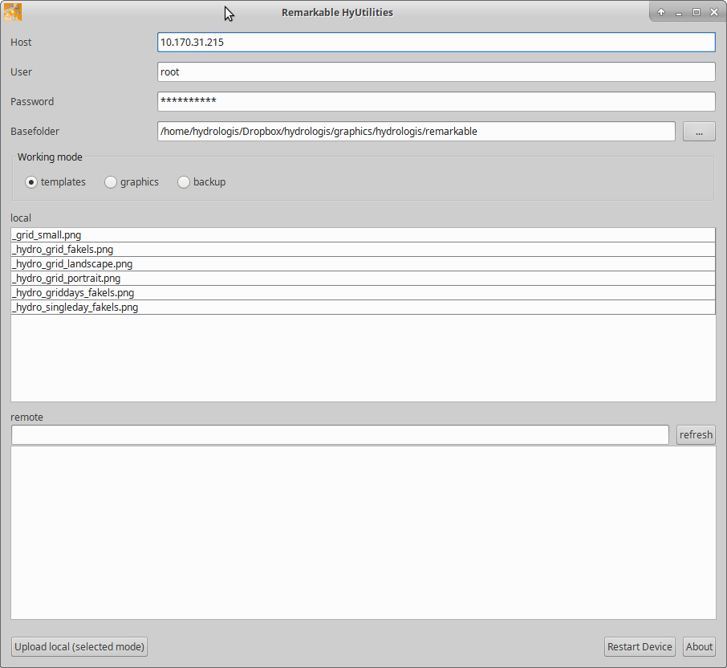
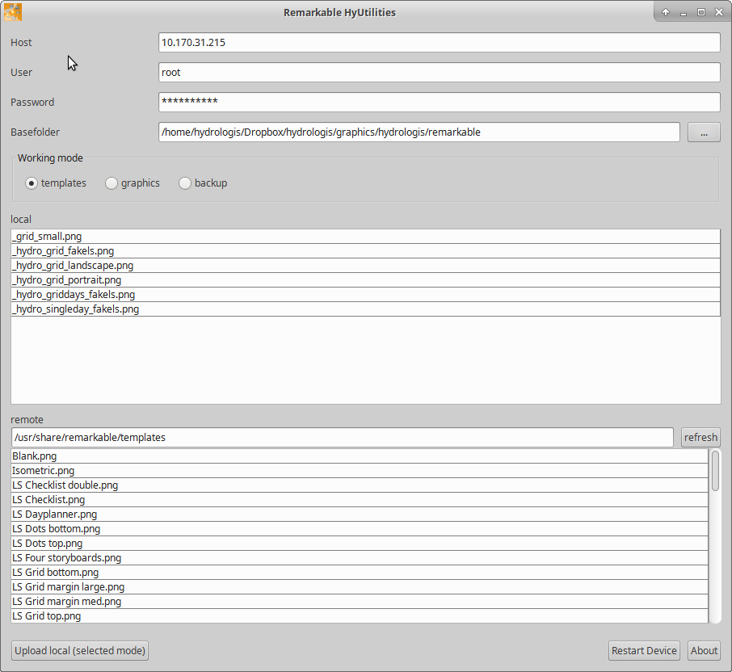
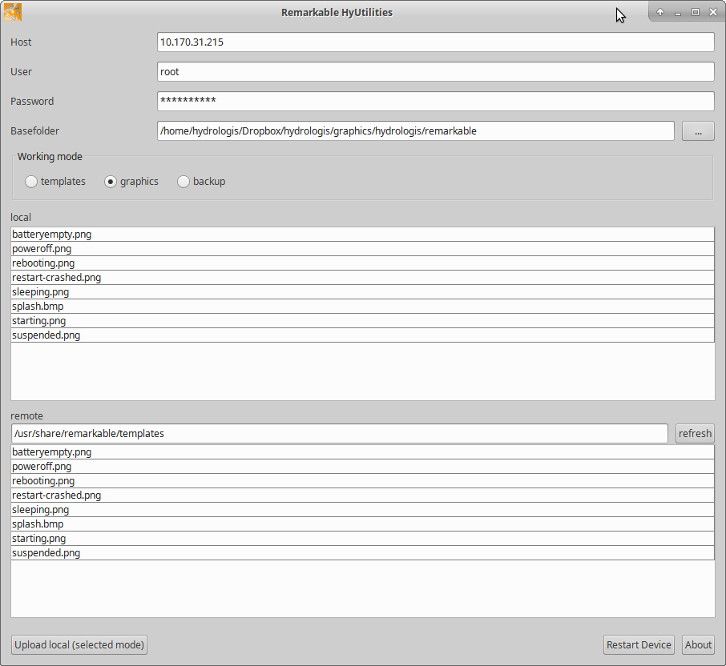
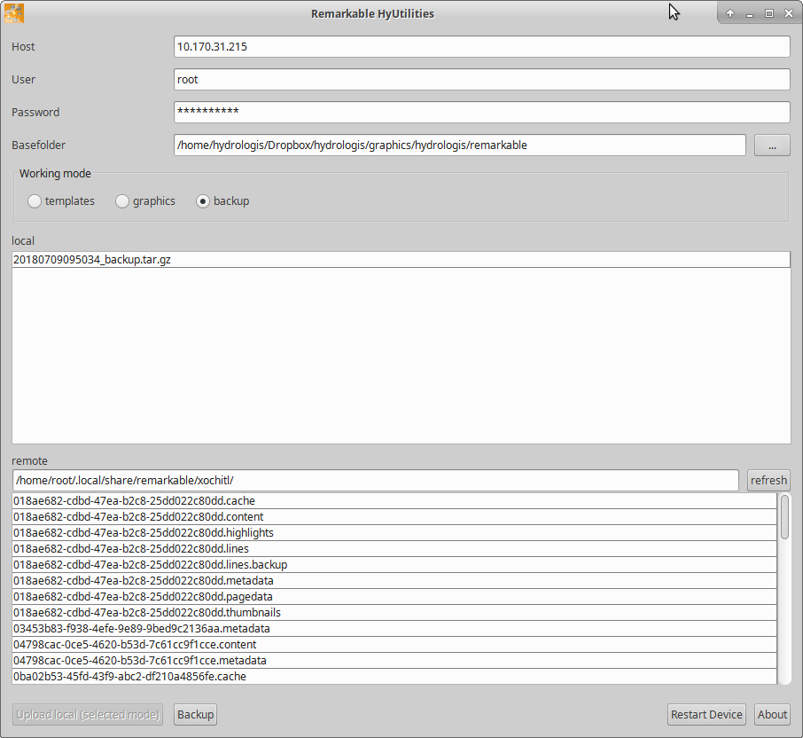
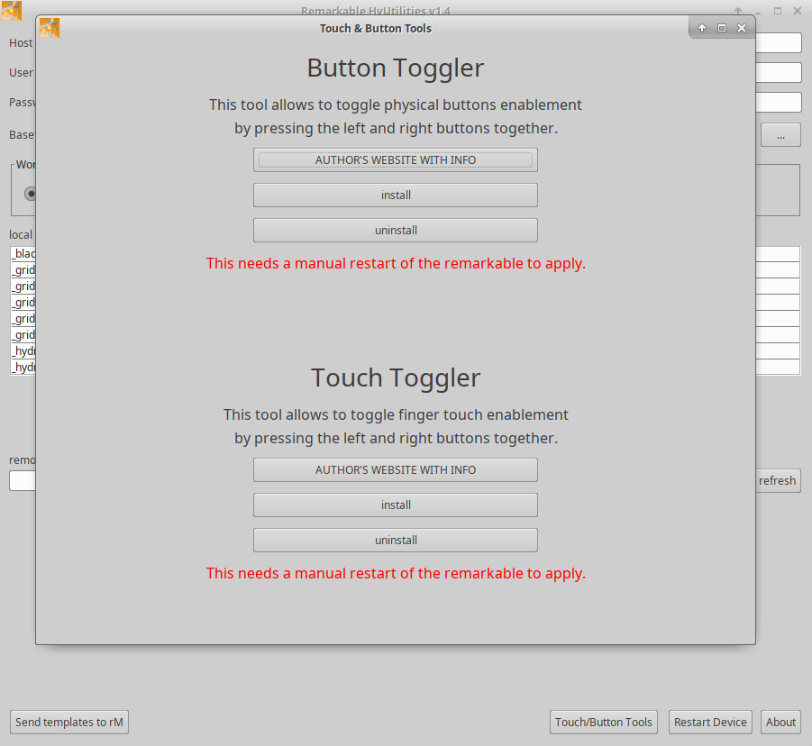
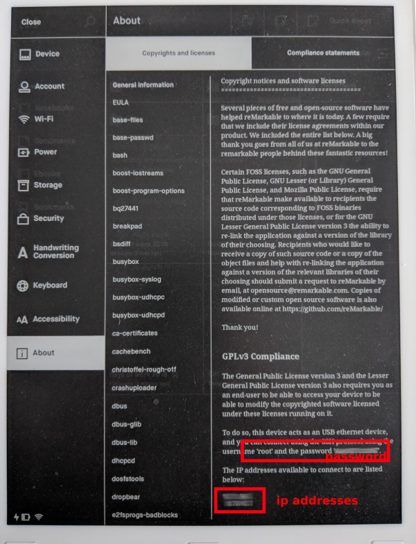

# reMarkable HyUtilities

**Don't care, where do I get it?** [LAST VERSION HERE](https://github.com/moovida/remarkable-hyutilities/releases/download/v1.4/remarkable_hyutilities_v1.4.zip)

reMarkable HyUtilities is a simple application that helps the reMArkable user 
mainly with 3 things that I have been missing. Maybe some of them
are available to windows or apple users, but they suck for linux users.

1. upload of templates. At every update the templates are reset to factory,
   so my personalized ones are gone. I needed a quick tool to restore them.
   ssh and scp and even FileZilla are good, but I needed something that 
   didn't require my brain.
2. upload of graphics. Same as for templates. I customized all possible 
   graphics (splash, reboot, etc), so I need to restore them.
3. backup. This is important. At the time being there is no way to backup 
   the raw data. The story that pushed me to this development was a user 
   that reported his reMarkable stolen and was afraid that the thief would 
   delete everything from it before being able to somehow disconnect the 
   cloud account and save the data. Since we are making big use of the device, 
   this is a HUGE issue.

## First startup

Download the application [from the release page](https://github.com/moovida/remarkable-hyutilities/releases)
and unzip it on your disk.

**If you are on windows:** run the start.exe and you are done.

**If you are on linux or macosx:**

* make sure java is installed ([java](https://java.com/en/download/help/download_options.xml) 8 or newer)
* run the start.sh script

Once launched, you should see something like:

the first time you run it you will need to insert:

* the host, i.e. the ip address of your reMarkable device
* the user: root
* the password to your device
* the folder on your disk to use as a base for your data. Notice that it is mandatory to have 3 folders already in it:
  - templates: put there all your template images, can be empty
  - graphics: put there all your custom graphics, can be empty
  - backup: can be empty

## Templates 

If working mode **templates** is selected, then the local templates should be shown.

If you put the **refresh** button, the remote ones will be shown.

Push the **Upload local** button and the app will upload your templates to the device.

## Graphics

The working mode **graphics** works exactly the same way as the templates mode.

## Backup

The **backup** mode is a download only mode at the moment. It enables the backup button:

If that one is pushed, the application will:

* compress all your data on the device 
* download the tar.gz archive to the local folder
* remove the archive from the device again

**Note that the backup action can be very long going if you have many data on the device. Let the app the time to finish.**

## Touch and button tools

I spend half of my remarkable-life using the tablet in landscape mode in order to avoid pushing 
the right page button while writing with the palm of my hand.

[This great guy](https://github.com/LinusCDE/) wrote 2 interesting applications, one of which is what I have been long 
looking for:

* [rmButtonToggler](https://github.com/LinusCDE/rmButtonToggler), which allows to disable the buttons using a shortcut.
* [rmTouchToggler](https://github.com/LinusCDE/rmTouchToggler), which allows to disable finger touches using a shortcut.

It is now possible to install them with a few clicks from the utils:

Please read the suggestions of the author before installing. 

## Restart device

There is also a restart device button. Once uploads have been done, it is better to restart your device. 
It can be done manually or through the button.

# Warning

This software is developed by [HydroloGIS S.r.l.](http://www.hydrologis.com) and released under GPL v3.0 license.

We carry no responability if the software burned your reMarkable to death or destroyed your data (but yes, we would be very sorry about that).

If you find the application useful and feel the urge to thank us, send us a box of good beer from your country.

If you find bugs, feel free to report them here as issues.

# FAQ

## How can I find the ip address and password to use?

When connected to a WIFI with your remarkable, tap on the very upper left **rM** at the left 
of the search icon. This will enter the configurations view.

Frome there select the last item of the left sidemenu: **About**. 

By default the **Copyright and Licenses** tab should be selected. Look at the very bottom right. The last paragraph
states: **The IP addresses available to connect to are listed below**, followed by the ip address to use in the 
application.

Right above this part the username and password are defined. That is the password to use in the application.

Look at the following screenshot if you are not sure where to find ip addresses and password:

